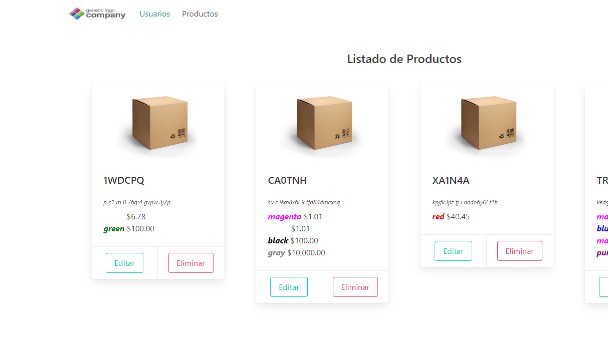
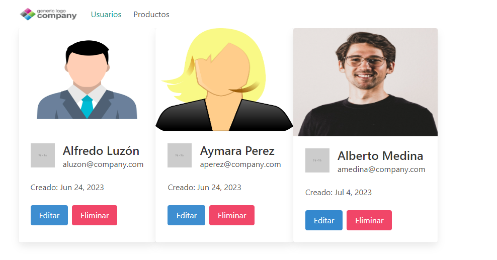
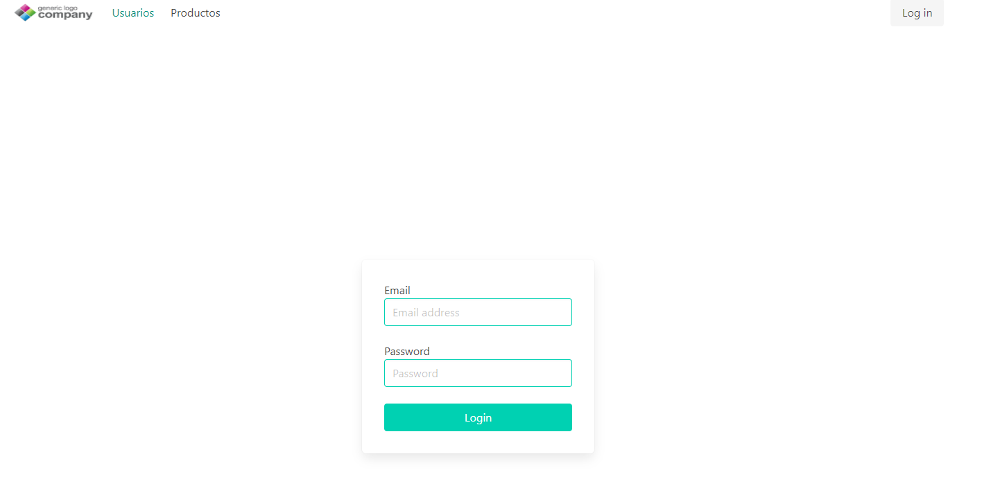

# Programming Test 3

## Build and run Backend

Abrir la solución en Visual Studio, Seleccionar el proyecto Backend y ejecutarlo.
Elegir el perfil 'Backend' (Tiene puertos correctos configurados en caso de tener un frontend).

```batch
cd ProgrammingTest3
dotnet publish Backend -c Release -r win-x64 -o "Binaries/Backend"
```

Cambiar al directorio con el output (en este caso Binaries/Backend) y ejecutar Backend.exe.

## Build and run Frontend

```batch
cd frontend
npm install
npm run start
```

Luego acceder al sitio ```http://localhost:4200```
El programa del Backend debe estar ejecutandose

## ScreenShots

### Productos



### Usuarios


### Login

